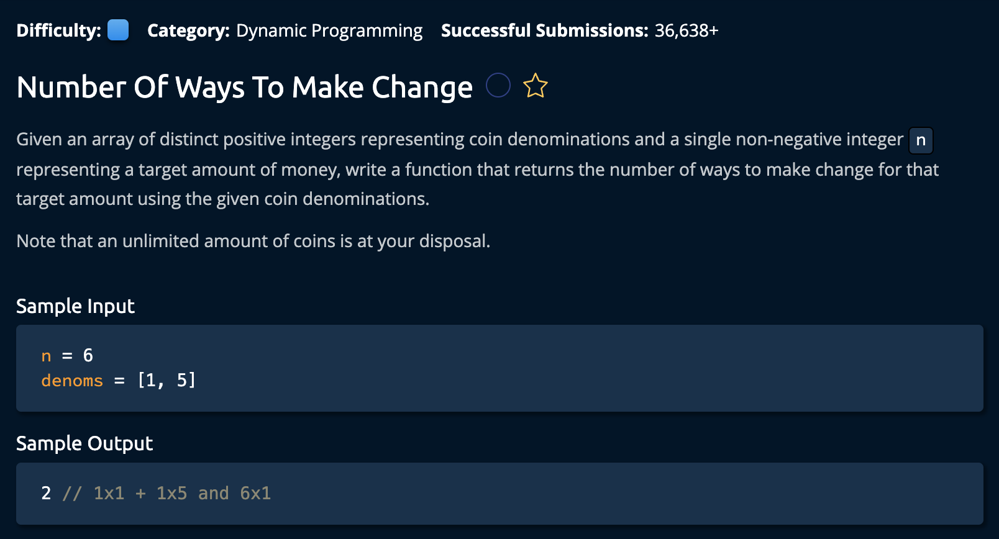

# Number Of Ways To Make Change

## Description



## Solution

```py
def numberOfWaysToMakeChange(n, denoms):
    ways = [0 for _ in range(n + 1)]
    ways[0] = 1

    for denom in denoms:
        for amount in range(1, n + 1):
            if denom <= amount:
                ways[amount] += ways[amount - denom]
            else:
                continue

    return ways[-1]
```

**Time Complexity:** O(n) where `n` is the target value<br/>
**Space Complexity:** O(nd) where `d` is the length of the input array. ie the number of coins <br/>

### Approaching The Solution

The idea is to create a new array called `ways[]`. Each index in this array represents the number of ways we can make the that amount of change using the coins we have.<br>

```py
#       0, 1, 2, 3, 4, 5
#  ways[1, 1, 1, 1, 2, 1]
#  This means there are 2 ways to make 4 given
#  the array of coins and only one way for the rest
```

We have a base case: There is only ONE way to make 0 change, using zero coins.

```py
def numberOfWaysToMakeChange(n, denoms):
    ways = [0 for _ in range(n + 1)]
    ways[0] = 1
```
As you can see, after creating the array of size n + 1, we initialize the first idnex to 1 to represent this case. Why n+1? because we want index 1 to represent the first value: 1. Rather than index 1 representing the second value like normal.

```py
for denom in denoms:
        for amount in range(1, n + 1):
            if denom <= amount:
                ways[amount] += ways[amount - denom]
            else:
                continue
```

Now we've created the algorithm that iterates through the input array and checks if we can create the amount of change from 1 to n in the `ways[]` array.

- `denom` is the current coin we are using as the composite
- `amount` represtent the number who's composite count we are evaluating 

If the current coin(denom) is alrger than the amount, we skip it.(we cant make a change of 10 with a 25 coin). Otherwise we icnrease the `ways[]` count.

Finally we return the last element in ways[].
```py
return ways[-1]
```
and we're **Done!**
