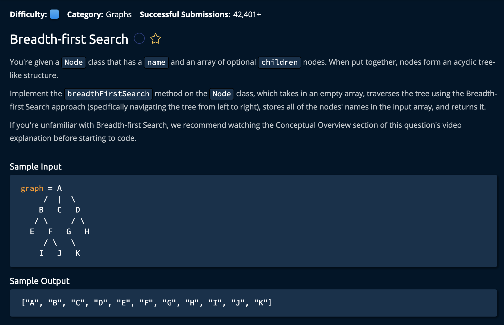

# Breadth First Search

## Description



## Solution
```py
def breadthFirstSearch(self, array):
    queue = [self]
    while len(queue) > 0:
        current = queue.pop(0)
        array.append(current.name)
        for child in current.children:
            queue.append(child)
            
    return array
```

**Time Complexity:** O(V + E) **V** for every vertex and **E** for every Edge. For every vertex we loop through the children<br/>
**Space Complexity:** O(V) since the `queue` can hold at most every vertex<br/>

### Approach

The idea is to start at the root node, utilizing our `queue` which is initialized with the root node, we pop it, add its value to hte array, then place all of its children into the `queue`. We repeat this proccess by poping the next value, by the end we would have traversed the entire graph.

1. Initialize the queue to the root node. 

```py
def breadthFirstSearch(self, array):
    queue = [self]
```

2. As long as the queue is not empty(which means there are children remaining), we remove it, store it's value to the array that we are returning. After that we utilize a for loop to add all of the children to the queue.

```py
while len(queue) > 0:
        current = queue.pop(0)
        array.append(current.name)
        for child in current.children:
            queue.append(child)
```

3. Finally we return the array.

```py
return array
```

and we're **Done!**