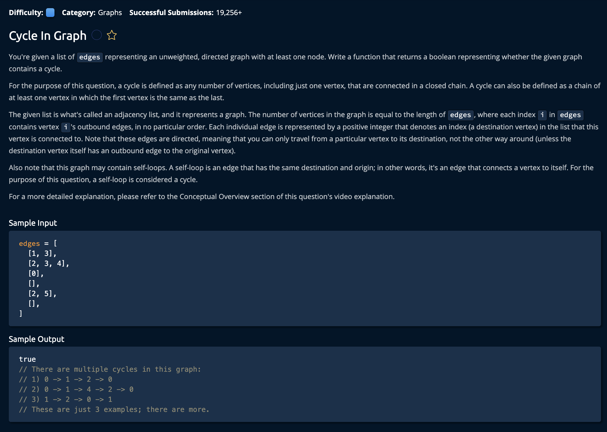

# Cycle In Graph

## Description



## Solution
```py
def cycleInGraph(edges):
    numberOfNodes = len(edges)
    visited = [False for _ in range(numberOfNodes)]
    currentlyInStack = [False for _ in range(numberOfNodes)]

    for node in range(numberOfNodes):
        if visited[node]:
            continue
            
        containsCycle = isNodeInCycle(edges, node, visited, currentlyInStack)
        if containsCycle:
            return True
            
    return False

def isNodeInCycle(edges, node, visited, currentlyInStack):
    visited[node] = True
    currentlyInStack[node] = True
    neighbors = edges[node]
    
    for neighbor in neighbors:
        if not visited[neighbor]:
            containsCycle = isNodeInCycle(edges, neighbor, visited, currentlyInStack)
            if containsCycle:
                return True
        elif currentlyInStack[neighbor]:
            return True

    currentlyInStack[node] = False
    return False
```

**Time Complexity:** O(V + E) **Width** * **Height** for visitng every index in the `matrix`<br/>
**Space Complexity:** O(W * H) for creating a matrix of equal size in boolean values<br/>

### Approach

The idea is to keep track of every visited node, while we traverse the graph we perform the function isNodeInCycle() that performs a Depth-First-Search to see if we can find a cycle from that node. <br> 

Now, this function will likely checks several ndoes so we check if that node has been visited before we perform the DFS. Let's break down the steps:


1. Determine the number of nodes that are in the graph by finding the legth of the edges array(each index of edges holds a list of edges for each node. ie edges[0] contains an array of edges for teh first node in the graph). <br>
Then we create two arrays to determin if those nodes have been visited and if theu are currently on the stack.

```py
numberOfNodes = len(edges)
visited = [False for _ in range(numberOfNodes)]
currentlyInStack = [False for _ in range(numberOfNodes)]
```

2. for every node, we check of that node has been visited, if not we perform the isNodeInCycle/DFS on that node. IF the function returns true, we return True and end the loop. <br>
(note that isNodeInCycle() marks nodes as visited in the visited array so that we do not perform unnecessary calculations)

```py
for node in range(numberOfNodes):
    if visited[node]:
        continue
        
    containsCycle = isNodeInCycle(edges, node, visited, currentlyInStack)
    if containsCycle:
        return True
        
return False
```
If we reach the end of the array without returning True we return false since there was no cycles in the graph.

## isNodeInCycle(edges, node, visited, currentlyInStack)
`edges` - the list of edges for each node <br>
`node` - the current node we are performing DFS on<br>
`visited` - the list of previously visited nodes(likely to be updated)<br>
`currentlyInStack` - used to keep track of the stack for DFS<br>

3. Immediately mark current `node` as visited, and place it on the stack. Also, store it's edges in variable `neighbors`

```py
def isNodeInCycle(edges, node, visited, currentlyInStack):
    visited[node] = True
    currentlyInStack[node] = True
    neighbors = edges[node]
```

4. For every neighbor in the neighbors array, fi that neighbor has not been visited we call the recursuve function as our DFS operation. We also check if it ends up finding a cycle, if so we return True.

```py
if not visited[neighbor]: # if node has been visited, do nothing
    containsCycle = isNodeInCycle(edges, neighbor, visited, currentlyInStack)
    if containsCycle: # did it find a cycle?
        return True
```

5. if `neighbor` has been visited, we check if it's in the `currentlyInStack` variable: meaning it's on the stack and either the `node` passed in the function call or any of its neighbors. 

To put it plainly, it means we visited the same node twice.
```py
        elif currentlyInStack[neighbor]:
            return True
```

Now if we checked all the neighbours and found no cycles, we take the current node off of the stack and return False.

```py
    currentlyInStack[node] = False
    return False
```
and we're **Done!**