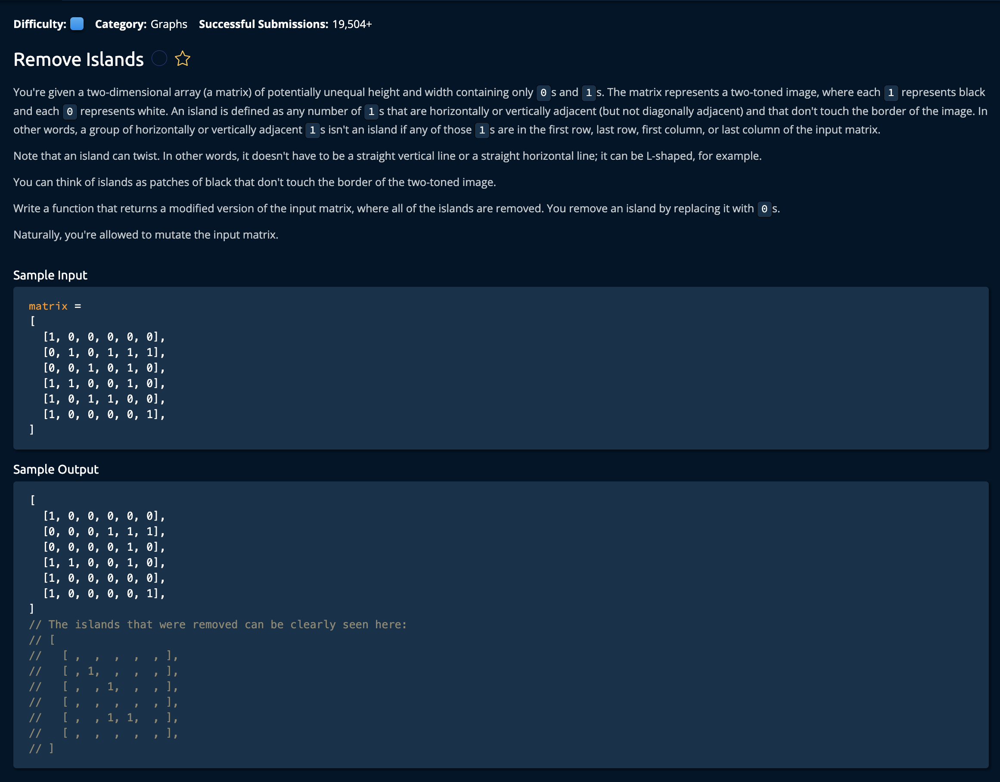

# Remove Islands

## Description



## Solution
```py
def removeIslands(matrix):
    for row in range(len(matrix)):
        for col in range(len(matrix[row])):
            rowIsBorder = row == 0 or row == len(matrix) - 1
            colIsBorder = col == 0 or col == len(matrix[row]) - 1
            isBorder = rowIsBorder or colIsBorder
            if not isBorder:
                continue
            if matrix[row][col] != 1:
                continue
                
            changeOnesConnectedToBorderToTwos(matrix, row, col)

    for row in range(len(matrix)):
        for col in range(len(matrix[row])):
            color = matrix[row][col]
            if color == 1:
                matrix[row][col] = 0
            elif color == 2:
                matrix[row][col] = 1
            
    return matrix

def changeOnesConnectedToBorderToTwos(matrix, startRow, startCol):
    stack = [(startRow, startCol)]

    while len(stack) > 0:
        currentPosition = stack.pop()
        currentRow, currentCol = currentPosition
        
        matrix[currentRow][currentCol] = 2
        
        neighbors = getNeighbors(matrix, currentRow, currentCol)
        for neighbor in neighbors:
            row, col = neighbor
            
            if matrix[row][col] != 1:
                continue
                
            stack.append(neighbor)

def getNeighbors(matrix, row, col):
    neighbors = []

    numRows = len(matrix)
    numCols = len(matrix[row])
    
    if row - 1 >= 0: # Up
        neighbors.append((row - 1, col))
    if row + 1 < numRows: # Down
        neighbors.append((row + 1, col))
    if col - 1 >= 0: # left
        neighbors.append((row, col - 1))
    if col + 1 < numCols: # right
        neighbors.append((row, col + 1))
    return neighbors
```

**Time Complexity:** O(W * H) **Width** * **Height** for visitng every index in the input `matrix`<br/>
**Space Complexity:** O(W * H) our stack inchangeOnesConnectedToBorderToTwos() could have at most W * H elements<br/>

### Approach

The idea is to taverse the border of the `matrix` and change any bordering nodes with the value 1 to 2. This effectively marks it as a "Bordering Landmass" Once we find such a node, we change all of the adjacent nodes as well. Lastly, we iterate through the entire matrix a second time and change any remaining ones to 0- effectively removing the "Island". We also change the 2's back to 1's since we found the "Non-Bordering Landmasses".<br>

Let's break this down step by step.

1. Create a nested for loop that iterates through every Element in the array. At each point have it check if the element is at any of the for borders AND is equal to 1. If so, we change the connected border to twos.

```py
def removeIslands(matrix):
    for row in range(len(matrix)):
        for col in range(len(matrix[row])): # nested for loop
            # check if element is at border
            rowIsBorder = row == 0 or row == len(matrix) - 1
            colIsBorder = col == 0 or col == len(matrix[row]) - 1
            isBorder = rowIsBorder or colIsBorder
            if not isBorder:
                continue
            if matrix[row][col] != 1:
                continue
            # we change the connected border to twos
            changeOnesConnectedToBorderToTwos(matrix, row, col)
```

2. After all this is done, every border-connected 1 will be a 2 and every non-border-connected 1 will still be one. So now, allwe ahve to do is remove the ones, and change the 2's back to ones

```py
for row in range(len(matrix)):
    for col in range(len(matrix[row])):
        color = matrix[row][col]
        if color == 1:
            matrix[row][col] = 0
        elif color == 2:
            matrix[row][col] = 1
        
return matrix
```
Now, lets break down that **changeOnesConnectedToBorderToTwos()** function.

## changeOnesConnectedToBorderToTwos(matrix, startRow, startCol)
`matrix` - the matrix we are observing<br>
`startRow` - the current row of the bordering node<br>
`startCol` -  the current column of the bordering node<br>

The idea is to create a `stack`, visit the node, then add its top, bpottom, eft and right nodes that == 1: Provided that they do not leave the bounds of the matrix.

3. Create a while loop that continues until the stack is empty, pops the first node off the stack, and changes that node's value from 1 to 2.

```py
def changeOnesConnectedToBorderToTwos(matrix, startRow, startCol):
    stack = [(startRow, startCol)]

    while len(stack) > 0:
        currentPosition = stack.pop()
        currentRow, currentCol = currentPosition
        
        matrix[currentRow][currentCol] = 2
```

4. Then it checks for any neighboring nodes that are equal to one and adds it to the stack only if it is == 1.

```py
neighbors = getNeighbors(matrix, currentRow, currentCol)
    for neighbor in neighbors:
        row, col = neighbor
        
        if matrix[row][col] != 1:
            continue
            
        stack.append(neighbor)
# end of while loop
```

The while loop goes back to hte top and checks if the stack is empty.

## getNeighbors(matrix, row, col)
`matrix` - the matrix we are observing<br>
`startRow` - the current row of the node<br>
`startCol` -  the current column of the node<br>

The goal of this function is to grab the node above, below, to the left and to the right. So, we check if we are at a bordering node, if so we do not append the direction we are boardering.

5. Get the number of rows and columns so that we ensure we stay within the bounds of the matrix 
```py
def getNeighbors(matrix, row, col):
    neighbors = []

    numRows = len(matrix)
    numCols = len(matrix[row])
```

6. For the 4 directions, check if the current index borders it, if not, we move one index in that direction by adding or subtracting one to the `col`, or `row` value.

```py
    if row - 1 >= 0: # Up
        neighbors.append((row - 1, col))
    if row + 1 < numRows: # Down
        neighbors.append((row + 1, col))
    if col - 1 >= 0: # left
        neighbors.append((row, col - 1))
    if col + 1 < numCols: # right
        neighbors.append((row, col + 1))
    return neighbors
```
This neighbors array will be returned into the **changeOnesConnectedToBorderToTwos()** function. It will then be looped through and each index with be checked if `matrix[row][col] != 1`

That's it, we're **Done!**