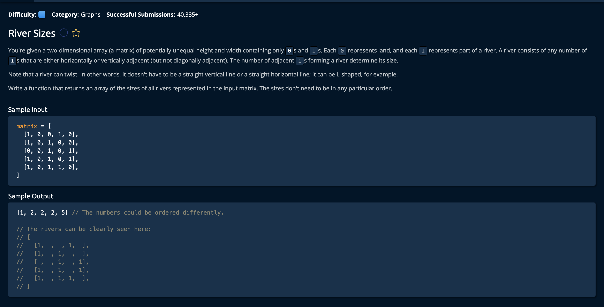

# RiverSizes

## Description



## Solution
```py
def riverSizes(matrix):
    sizes = []
    visited = [[False for value in row] for row in matrix]
    for i in range(len(matrix)):
        for j in range(len(matrix[i])):
            if visited[i][j]:
                continue
            traverseNode(i, j, matrix, visited, sizes)
    return sizes

def traverseNode(i, j, matrix, visited, sizes):
    currentRiverSize = 0
    nodesToExplore = [[i,j]]
    while(len(nodesToExplore)):
        currentNode = nodesToExplore.pop()
        i = currentNode[0]
        j = currentNode[1]
        if visited[i][j]:
            continue
        visited[i][j] = True
        if matrix[i][j] == 0:
            continue
        currentRiverSize += 1
        unvisitedNeighbors = getUnvisitedNeighbors(i, j, matrix, visited)
        for neighbor in unvisitedNeighbors:
            nodesToExplore.append(neighbor)
    if currentRiverSize > 0:
        sizes.append(currentRiverSize)
        
def getUnvisitedNeighbors(i, j, matrix, visited):
    unvisitedNeighbors = []
    if i > 0 and not visited[i - 1][j]:
        unvisitedNeighbors.append([i - 1, j])
    if i < len(matrix) - 1 and not visited[i + 1][j]:
        unvisitedNeighbors.append([i + 1, j])
    if j > 0 and not visited[i][j - 1]:
        unvisitedNeighbors.append([i, j - 1])
    if j < len(matrix[i]) - 1 and not visited[i][j + 1]:
        unvisitedNeighbors.append([i, j + 1])
    return unvisitedNeighbors
    
```

**Time Complexity:** O(W * H) **Width** * **Height** for visitng every index in the `matrix`<br/>
**Space Complexity:** O(W * H) for creating a matrix of equal size in boolean values<br/>

### Approach

The idea is to iterate through the matrix and implement depth first search on the adjacent indeces with the value of 1. **(1)** The algorithm checks if the index is one, if so **(2)** it increments the `currentRiverSize` and performs a check on all 4 adjecent indeces. **(3)** If it finds another adjecent one it moves to that index and performs the actions from step 1. Lets break down the steps:

1. Create the variables to return the answer(`sizes`) and keep track of visited indeces(`visited`)

```py
sizes = []
visited = [[False for value in row] for row in matrix]
```

2. Create a nested for loop to iterate by row and column. If the indece has been visited, we continue iterating without making any calculations. If not we pass the index down to the **traverseNode()** function, which will update the `visited` matrix and count the rivers.

```py
for i in range(len(matrix)):
    for j in range(len(matrix[i])):
        if visited[i][j]:
            continue
        traverseNode(i, j, matrix, visited, sizes)
```

## TraverseNode()
`i` - the row in the 2D matrix <br>
`j` - the column of the 2D matrix<br>
`matrix` - the matrix we are observing<br>
`visited` - the matrix used to keep track of visited indeces<br>
`sizes` -  the array of river sizes we will return<br>

3. Create variables to count the currently observed river(`currentRiverSize`) and a array of coordinates(`nodesToExplore`) that we will need to explore. ie. the node to the top, bottom, left and right given that it does not laeve the bounds of the index.

```py
def traverseNode(i, j, matrix, visited, sizes):
    currentRiverSize = 0
    nodesToExplore = [[i,j]]
```

4. As long as there are nodes to explore given the index we are supplied[i, j], we pop that index and check if its visited: if so, we do nothing

```py
while(len(nodesToExplore)):
        currentNode = nodesToExplore.pop()
        i = currentNode[0]
        j = currentNode[1]
        if visited[i][j]: # has the node we just popped been visited?
            continue
```

If it has not been visited, we mark it as visited and check if it's value is **0**, if so we do nothing, if it's **1**, we increase the count of `currentRiverSize` and get all of the neighboring nodes so that we can check if they are equal to 1 or 0 on the next while loop.
```py
visited[i][j] = True
        if matrix[i][j] == 0:
            continue
        currentRiverSize += 1
        unvisitedNeighbors = getUnvisitedNeighbors(i, j, matrix, visited)
        for neighbor in unvisitedNeighbors:
            nodesToExplore.append(neighbor)
# the getUnvisitedNeighbors() function will be defined later
```

At the end of all of this, we check if the river size is larger than 0, if so we add it to our return array `sizes`.

```py
if currentRiverSize > 0:
    sizes.append(currentRiverSize)
```
Now, lets define getUnvisitedNeighbors(): <br>

## getUnvisitedNeighbors()

`i` - the row in the 2D matrix <br>
`j` - the column of the 2D matrix<br>
`matrix` - the matrix we are observing<br>
`visited` - the matrix used to keep track of visited indeces<br>

The idea is to return an array of the top, bottom, left and right nodes- given that they fall within the bounds of the matrix and have not been visited already.

1. Initialize our `unvisitedNeighbors` to return later. 
```py
def getUnvisitedNeighbors(i, j, matrix, visited):
    unvisitedNeighbors = []
```

2. If the we are in at least the second row, we look at the above node and add it to the `unvisitedNeighbors[]` array if it has not been visited.
```py
if i > 0 and not visited[i - 1][j]:
    unvisitedNeighbors.append([i - 1, j])
```

3. If the we are in at most the second to last row, we look at the below node and add it to the `unvisitedNeighbors[]` array if it has not been visited.
```py
if i < len(matrix) - 1 and not visited[i + 1][j]:
    unvisitedNeighbors.append([i + 1, j])
```

4. If the we are in at least the second column, we look at the left node and add it to the `unvisitedNeighbors[]` array if it has not been visited.
```py
if j > 0 and not visited[i][j - 1]:
    unvisitedNeighbors.append([i, j - 1])
```

5. If the we are in at most the second to last column, we look at the right node and add it to the `unvisitedNeighbors[]` array if it has not been visited.
```py
if j < len(matrix[i]) - 1 and not visited[i][j + 1]:
    unvisitedNeighbors.append([i, j + 1])
return unvisitedNeighbors # after all these checks we return the array
```

6. Finally back in the RiverSizes Fuinction, when we have visited every node we return the `sizes` array. 
```py
return array
```
and we're **Done!**