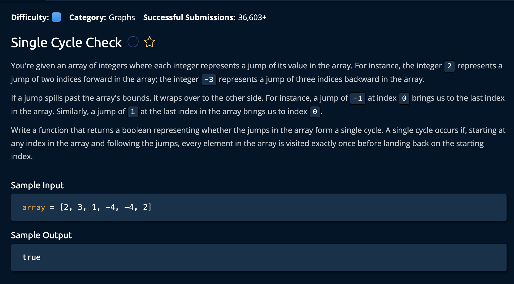

# Min-Heap Construction

## Description



## Solution
```py
def hasSingleCycle(array):
    numElementsVisited = 0
    currentIdx = 0
    while numElementsVisited < len(array):
        if numElementsVisited > 0 and currentIdx == 0:
            return False
        numElementsVisited += 1
        currentIdx = getNextIdx(currentIdx, array)
        
    return currentIdx == 0

def getNextIdx(currentIdx, array):
    jump = array[currentIdx]
    nextIdx = (currentIdx + jump) % len(array)
    return nextIdx if nextIdx >= 0 else nextIdx + len(array)
```

### Approach

There are two main cases that we observe to determine weather or not there is a cycle.

-   using a counter to keep track of each time we visit a node: `numElementsVisited` if we visit the same index twice and `numElementsVisited` < the size of the array, there is no single cycle

-   if `numElementsVisited` == to the size of the array AND we are not back at the first visited index, there is no single cycle

1. First we initialize the `numElementsVisited`: used to keep track of elements we've visited while iterating through the input array. We also initialize `currentIdx`: used to iterate through the array.

```py
numElementsVisited = 0
currentIdx = 0
```

2. Create a while loop that contonues as long as the numElementsVisited is less than the length of the array. At each index, check if the start index is visited twice, if so return False.

```py
while numElementsVisited < len(array):
    if numElementsVisited > 0 and currentIdx == 0:
        return False
    numElementsVisited += 1
    currentIdx = getNextIdx(currentIdx, array)
```

Also note after visiting a node we increment `numElementsVisited` and get the next index.

## DEFINE: getNextIdx(currentIdx, array)

`currentIdx` - this is the index that contains the jump value
`array` - the array with the values

We assign `jump = array[currentIdx]` to get the jump value. Then we find the nextIdx by adding the currentIdx with the jump value. Note we use the modulus so that function wraps around the array in the case that the jump value passes the bounds of the array.

```py
def getNextIdx(currentIdx, array):
    jump = array[currentIdx]
    nextIdx = (currentIdx + jump) % len(array)
    return nextIdx if nextIdx >= 0 else nextIdx + len(array)
```

The return function also takes care of the edge case where the jump value is negative, if so, we return `nextIdx + len(array)` since -1 is effectively len(array) - 1. <br>

and we're **Done!**