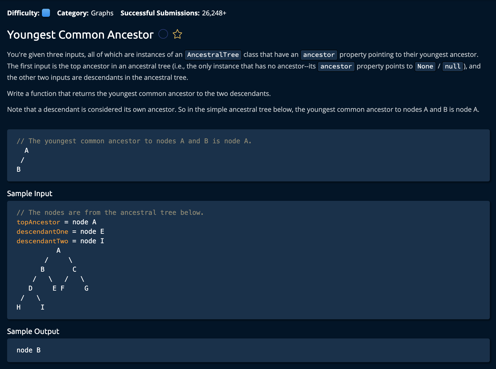

# Youngest Common Ancestor

## Description



## Solution
```py
# This is an input class. Do not edit.
class AncestralTree:
    def __init__(self, name):
        self.name = name
        self.ancestor = None


def getYoungestCommonAncestor(topAncestor, descendantOne, descendantTwo):
    depthOne = 0
    depthTwo = 0
    nodeOne = descendantOne
    nodeTwo = descendantTwo
    
    while nodeOne.ancestor is not None:
        depthOne += 1
        nodeOne = nodeOne.ancestor
    while nodeTwo.ancestor is not None:
        depthTwo += 1
        nodeTwo = nodeTwo.ancestor
    
    if depthOne < depthTwo:
        difference = depthTwo - depthOne
        for i in range(difference):
            descendantTwo = descendantTwo.ancestor
    else:
        difference = depthOne - depthTwo
        for i in range(difference):
            descendantOne = descendantOne.ancestor

    while descendantOne != descendantTwo:
        descendantOne = descendantOne.ancestor
        descendantTwo = descendantTwo.ancestor
    
    return descendantOne
```

**Time Complexity:** O(D) for ht edepth fo hte deepest node<br/>
**Space Complexity:** O(1)<br/>

### Approach

Since the level of ancestry is represetned by the **depth** fo the node, we will compare the two depths by setting two pointers at the nodes `descendantOne` and `descendantTwo`. Once we find that the deeper node, we will move that nodes pointer  *upwards* so that is at the same level as the other. After this, we can move both pointers up by one until the nodes paths collide: this will return the youngest descendant.<br>

Let's go through this step by step.

1. First Set our depth counter variables and out two pointers

```py
depthOne = 0
depthTwo = 0
nodeOne = descendantOne
nodeTwo = descendantTwo
```

2. Next, we calculate the depth by icnrementing the counters until we reach the root node.

```py
while nodeOne.ancestor is not None:
        depthOne += 1
        nodeOne = nodeOne.ancestor
while nodeTwo.ancestor is not None:
    depthTwo += 1
    nodeTwo = nodeTwo.ancestor
```

3. Now, depending on which node is bigger, we will find the difference and move the deeper node up accordingly.

```py
if depthOne < depthTwo:
    difference = depthTwo - depthOne
    for i in range(difference):
        descendantTwo = descendantTwo.ancestor
else:
    difference = depthOne - depthTwo
    for i in range(difference):
        descendantOne = descendantOne.ancestor
```

4. Now that both nodes are at the same place, we will move both nodes up by one until we find that they both are equal. The while loop ends when they are the same.

```py
while descendantOne != descendantTwo:
    descendantOne = descendantOne.ancestor
    descendantTwo = descendantTwo.ancestor

return descendantOne
```
and we're **Done!**