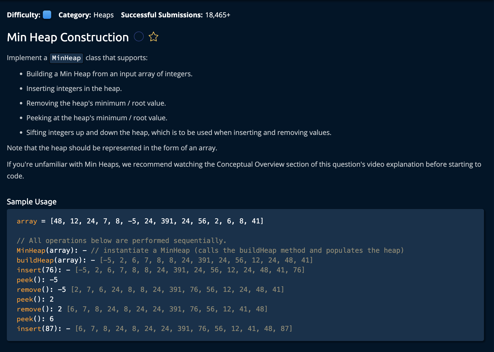

# Min-Heap Construction

## Description



## Solution

There are **7 functions** to write in order to complete this problem. We will go over them one at a time and draw a conclusion summarizing our combined algorithms.

### 1. swap()

```py
def swap(self, i, j, heap):
    heap[i], heap[j] = heap[j], heap[i]
```

This is a "Quality of Life" function that swaps the values of the two given indices `i` and `j` in the `heap`. You will see this being used in the code.

### 2. peek()

```py
def peek(self):
    return self.heap[0]
```

The peek function simply returns the root element (first element) of the heap array. This would be the first index. Keep in mind that since this is a **Min-Heap**, the root will always be the smallest value.

### 3. siftUp()

```py
# O(logn) time | O(1) Space
def siftUp(self,  currentIdx, heap):
    parentIdx = (currentIdx - 1) // 2
    while currentIdx > 0 and heap[currentIdx] < heap[parentIdx]:
        self.swap(currentIdx, parentIdx, heap)
        currentIdx = parentIdx
        parentIdx = (currentIdx - 1) // 2
```

`self` - to enable access to class instance functions and variables <br>
`currentIdx` - initially the last leaf node and represents the currently viewed node <br>
`heap` - the heap array we will be sifting up <br>

This function is used when inserting values in the heep. It starts by appending the new value as the last **leave node**, and shifts the value up a layer if that current value is smaller than its parent. We can calculate the parent node using the equation: `(currentIdx - 1) // 2`. The **while loop** continues until the `currentIdx` reaches the root node(0) or if the `currentIdx`'s value is _larger_ than its **parent** (in this case we wouldnt need to swap since it is now in the correct position). <br>

Remember, in a **Min-heap**, the parent is always smaller than the children.

### 4. siftDown()

```py
# O(logn) time | O(1) Space
def siftDown(self, currentIdx, endIdx, heap):
    leftIdx = currentIdx * 2 + 1
    while leftIdx <= endIdx:
        rightIdx = currentIdx * 2 + 2 if currentIdx * 2 + 2 <= endIdx else -1
        if rightIdx != -1 and heap[rightIdx] < heap[leftIdx]:
            idxToSwap = rightIdx
        else:
            idxToSwap = leftIdx

        if heap[idxToSwap] < heap[currentIdx]:
            self.swap(currentIdx, idxToSwap, heap)
            currentIdx = idxToSwap
            leftIdx = currentIdx * 2 + 1
        else:
            break
```

`self` - to enable access to class instance functions and variables <br>
`currentIdx` - initially the **root** node and represents the currently viewed node <br>
`endIdx` - the last index in the array | the last leaf node<br>
`heap` - the heap array <br>

This function is used to remove items from the heap. It starts by swapping the first and last value in the heap(the **root/first index** and **last leaf/last index**) and popping the swapped root value. Then it takes the swapped leaf value and shifts the value down layer by layer given this condition: <br>

```py
# if the current node's value is larger than smallest of its two children.
```

Keep in mind however, Removing an item from teh heap is a separeate function and only the _logic_ of "sifting Down" will be implemented in this function. <br>

We can calculate the left and right children using the equations: `leftIdx = currentIdx * 2 + 1` and `rightIdx = currentIdx * 2 + 2`. <br>

Inside the loop, we apply our formula to find the rightIdx and assign it to the variable `rightIdx` only if it doest surpass the last index in the heap(endIdx). The **while loop** continues until the `leftIdx` is greater than the `endIdx` (goes past the last leaf/index). <br>

If `leftIdx` hasn't surpassed the `endIdx`, and the `leftIdx` is the smaller of the two, then `leftIdx` is identified as the index that needs to be swapped(`idxToSwap`) with the currentIdx. Otherwise `rightIdx` is assigned to `idxToSwap`. Finally we check if the currentIdx is larger than the `idxToSwap`, and if so swap them and update the indexes for the next iteration. If not, we break out of the loop since it is already in the correct position.

### 5. Remove()

```py
# O(logn) time | O(1) Space
def remove(self):
    self.swap(0, len(self.heap) - 1, self.heap)
    valueToRemove = self.heap.pop()
    self.siftDown(0, len(self.heap) - 1, self.heap)
    return valueToRemove
```

When removing a value from a `heap`, the _root node_ is removed and swapped with the _last element_. In our case: the value at the last index(len(self.heap) - 1) will be swapped with the first(0), then we "pop" the last value. However, now we have the last value in the root node, whcih is obvously not the minimum value(since the deeper you go in a min-heap is the larger the number is). <br>

So after popping the last value, we call the siftdown function on the root node. Then we return the value we removed(`valueToRemove`).

### 6. insert()

```py
# O(logn) time | O(1) Space
def insert(self, value):
    self.heap.append(value)
    self.siftUp(len(self.heap) - 1, self.heap)
```

When adding a value to a heap , we append the value to the end of the heap array and then call the siftUp() to work on the last index in the array to ensure the min-heap property is maintained: `len(self.heap) - 1`.

### 7. buildHeap()

```py
# O(n) Time |  O(1) Space
def buildHeap(self, array):
    firstParentIdx = (len(array) - 2) // 2
    for currentIdx in reversed(range(firstParentIdx + 1)):
        self.siftDown(currentIdx, len(array) - 1, array)
    return array
```

This buildHeap function takes in an array and converts it into a min-heap. It starts by calculating the index of the first parent in the heap(which would be located at the bottom of the heap). Remember the function to find a parrent: `parentIdx = (childIdx - 1) // 2` since we are trying to find the parent of the index "`len(self.heap) - 1`", the algorithm looks like this:

```py
firstParentIdx = (len(self.heap) - 1 - 1) // 2 # Which is equivalent to..
firstParentIdx = (len(self.heap) - 2) // 2
```

Then, continuing from that first parent index, it iterates through the array in reverse order and calls siftDown on each parent index to ensure the min-heap property is maintained as we build the heap from an unsorted array.<br>

Finally, we return the heap array.

```py
return array
```

And we're **Done**!

Note that building the heap with the `siftUp()` method would be less efficient than the `siftDown()` method. This is because heaps are "bottom heavy", and traversing from one end to the other end of this data structure is O(logn) time. Therefore, sifting down is more effiicient because there are less nodes to sift from at the top for the `siftDown()` method, in contrast to `siftUp()` which has more nodes to sift at the bottom. <br>

Implementing a _mathmatical taylor series_ would result in the `siftDown()` approach having **O(n)** Time complexity while the `shiftUp()` approach would have **O(nlogn)** time complexity.
