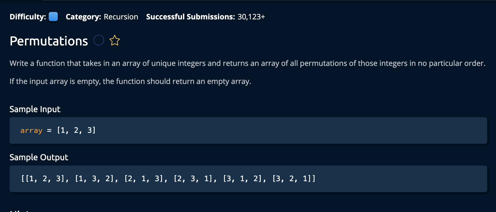

# Permutations

## Description



## Solution
```py
def getPermutations(array):
    permuations = []
    permuationsHelper(0, array, permuations)
    return permuations

def  permuationsHelper(i, array, permuations):
    if i == len(array) - 1:
        permuations.append(array[:])
    else:
        for j in range(i, len(array)):
            swap(array, i, j)
            permuationsHelper(i + 1, array, permuations)
            swap(array, i, j)
            
def swap(array, i, j):
    array[i], array[j] = array[j], array[i]
```

**Time Complexity:** O(W * Nlog(n)) Where W is the number of values in `words`, and Nlog(n) is the time complexity for sorting each word.<br/>
**Space Complexity:** O(WN) Where W is the number of values and N is the max length of each value.<br/>

### Approach
The idea is to create a recursive algorithm that swaps the currently observed index with every other index and adds it to the list of permutations -as long as the current index is not the last index. The base case is wehn the index is the last index: this indicates that we have successfully craeted a **permutation**.<br>


*Lets break down the steps.* <br>

1. Initialize our permutations array we will return. Also we call our helper functiomn that will recursively iterate through every possible combination of integer orders.
```py
def getPermutations(array):
    permuations = []
    permuationsHelper(0, array, permuations)
    return permuationse
```

### permuationsHelper(i, array, permuations)
`i`: This is the current index we will be swapping with every value in the array.
`array`: This is the array whos values we will be swapping
`permuations`: This will hold every possible ordering of elements.

2. BASE CASE: If the current index we are looking at is the last index, add our current snapshot of indices to the list of permutations.
```py
for word in words:
    sortedWord = "".join(sorted(word))
```

3. If we are not at the end of the array, we iterate through the current index to the end of the array, swapping the values, recursively calling the function on that swapped snapshot, then unswapping the values.

```py
else:
        for j in range(i, len(array)):
            swap(array, i, j)
            permuationsHelper(i + 1, array, permuations)
            swap(array, i, j)
```
We add 1 to `i` so that the recursive function loops through every possible combination by swappign the SECOND value, the next recursive function will do the same for the THIRD value and so on.<br>

#### Note the defintiion of the swap() function simply switches the values. This was added for code readability <br>
```py
def swap(array, i, j):
    array[i], array[j] = array[j], array[i]
```

and we're **Done!**