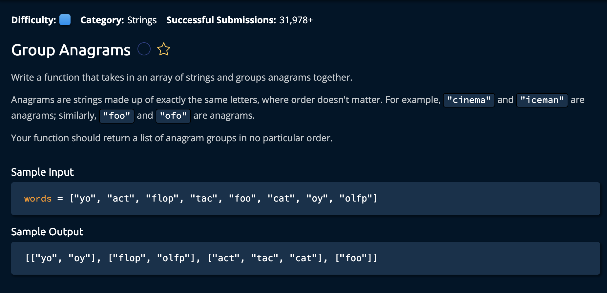

# Group Anagrams

## Description



## Solution
```py
def longestPalindromicSubstring(string):
    currentLongest = [0,1]

    for i in range(1, len(string)):
        odd = getLongestPalindromeFrom(string, i-1, i+1)
        even = getLongestPalindromeFrom(string, i-1, i)
        longest = max(odd, even, key = lambda x: x[1] - x[0])
        currentLongest = max(longest, currentLongest, key = lambda x: x[1] - x[0])

    return string[currentLongest[0]:currentLongest[1]]

def getLongestPalindromeFrom(string, leftIdx, rightIdx):
    while leftIdx >= 0 and rightIdx < len(string):
        if string[leftIdx] != string[rightIdx]:
            break
        leftIdx -= 1
        rightIdx += 1
    return [leftIdx + 1, rightIdx]
```

**Time Complexity:** O(W * Nlog(n)) Where W is the number of values in `words`, and Nlog(n) is the time complexity for sorting each word.<br/>
**Space Complexity:** O(WN) Where W is the number of values and N is the max length of each value.<br/>

### Approach
The idea is to create a hashtable and iterates through the `words` array. At each point, we sort that `word` and check if its in the hashtable(initially has no values). If it's a new word we add it to the hashtable, if its not then we append the unsorted word to the list corresponding to its sorted counterpart.<br>

For example:
```py
# Words: cat, tac, act
# the sorted version of each of these words is "act" and will be added as a list of strings in the hashtable.
```

Why do we sort the values? Because all anagram use the same characters, so if we sort them, even if they are different words their sorted version would be identical.

1. Create a hahstable and initialize it as empty.
```py
def groupAnagrams(words):
    anagrams = {} # hashtable
```

2. For every word in the `words` array, we sort that value
```py
for word in words:
    sortedWord = "".join(sorted(word))
```

3. Nect, we check if this `sortedWord` is already in the hashtable. If it is, we append the unsorted version to that list, if its not, we create a new list in hte hashtable.
```py
if sortedWord in anagrams:
    anagrams[sortedWord].append(word)
else:
    anagrams[sortedWord] = [word]
```

4. Python has a function that returns the values of a hashtable as a list, so we utilize it here. This anagrams.values holds all the anagrams separated by key value pairs in the hashtable

```py
return list(anagrams.values())
```
and we're **Done!**