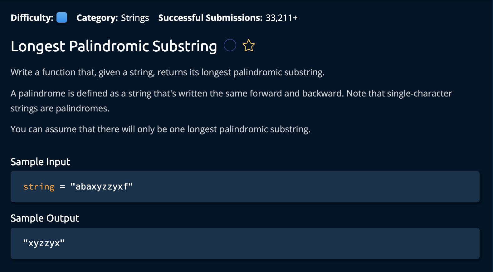

# Longest Palindromic Substring

## Description



## Solution
```py
def longestPalindromicSubstring(string):
    currentLongest = [0,1]

    for i in range(1, len(string)):
        odd = getLongestPalindromeFrom(string, i-1, i+1)
        even = getLongestPalindromeFrom(string, i-1, i)
        longest = max(odd, even, key = lambda x: x[1] - x[0])
        currentLongest = max(longest, currentLongest, key = lambda x: x[1] - x[0])

    return string[currentLongest[0]:currentLongest[1]]

def getLongestPalindromeFrom(string, leftIdx, rightIdx):
    while leftIdx >= 0 and rightIdx < len(string):
        if string[leftIdx] != string[rightIdx]:
            break
        leftIdx -= 1
        rightIdx += 1
    return [leftIdx + 1, rightIdx]
```

**Time Complexity:** O(n^2) for iterating throuigh the array for the two expansions(to check for palindrome)<br/>
**Space Complexity:** O(n) for returning the palidrome which is at msot the size of the array<br/>

### Approach
The idea is to loop through the string and at each index perform two operations.
- check if the string before and after it are equal(for odd palindromes)
- check if the current string and the string before it afre equal(for even palindromes)
Even palindromes have two middle characters while odd ones only have one. If initialize the first char as the longest palindrome, we can check every following character as a potential `middle character/midde two characters` of a palindrome.
 <br> 

1. Create a currentLongest variable to hold the indeces of our palindrome. We initializde it to the first and second value. 

Note that in Python, string[start:end] extracts the substring starting at start and ending just before end. So we initialize it to the first and second value even for the case where an array has only one value.

```py
def longestPalindromicSubstring(string):
    currentLongest = [0,1]
```

2. for every character in string we check for the longest palindrome concidering our two cases mentioned in our aproach above:
- check if the string before and after it are equal(for odd palindromes)
- check if the current string and the string before it afre equal(for even palindromes)

```py
for i in range(1, len(string)):
    # This checks the longest palindrome starting from every character in the array. 
    odd = getLongestPalindromeFrom(string, i-1, i+1)
    even = getLongestPalindromeFrom(string, i-1, i)
    longest = max(odd, even, key = lambda x: x[1] - x[0])
```
We use **lambda** that determines the max by comparing the difference between the two *coordinates* of both `odd` and `even`.

**i - 1** is the string before our currently observed character `i`.<br>
**i + 1** is the string after our currently observed character `i`.<br>

3. After all this we check if the currently calculated palindrome is larger than the `longestPalindrome` if so, we set it as the new longest.

```py
    currentLongest = max(longest, currentLongest, key = lambda x: x[1] - x[0])
```

### getLongestPalindromeFrom(string, leftIdx, rightIdx)
- `string`:  the input string we are observing to determine the palindromes
- `leftIdx`: the left index of the palindrome
- `rightIdx`: the right index of the palindrome

4. while both the left and right index are in the bounds of the array, we chekc if the strings at both indexes are equal, if not we break the loop, if so then we move the pointers outwards from the center.

```py
while leftIdx >= 0 and rightIdx < len(string):
        if string[leftIdx] != string[rightIdx]:
            break
        leftIdx -= 1
        rightIdx += 1
```

at the end we return the leftIdx + 1 because at the end of this while loop both `leftIdx` and `rightIdx` are one index past the palindrome. The reason we dont return `rightIDx - 1` is because the **end** in `string[start:end]` is non-inclusive as mentioned earlier. <br>

```py
return [leftIdx + 1, rightIdx]
```

Finally, at the end of the outer for loop, we splice the array at the final indices provided by the loop.
```py
return string[currentLongest[0]:currentLongest[1]] # does not include currentLongest[1]
```
and we're **Done!**