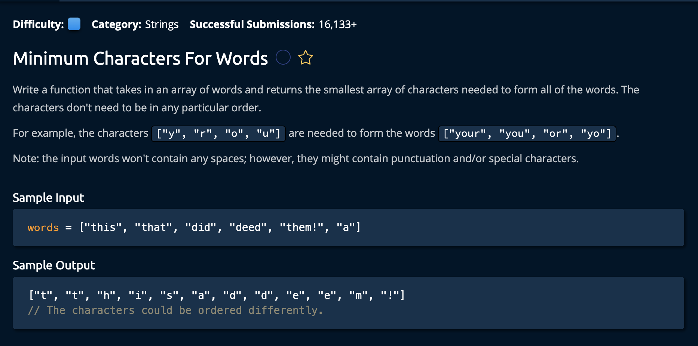

# Minimum Characters For Words

## Description 



## Solution
```py
def minimumCharactersForWords(words):
    mainMap = {}
    resultList = []
    for word in words:
        tempMap = {}
        for letter in word:
            if letter not in mainMap:
                mainMap[letter] = 1
                resultList.append(letter)
            tempMap[letter] = tempMap.get(letter, 0) + 1
            if tempMap[letter] > mainMap[letter]:
                resultList.append(letter)
                mainMap[letter] += 1
    return resultList
```

**Time Complexity:** O(n * l) where n is the number of words in `words`. and l is the length of the lognest word for the counting operation of every word.<br/>
**Space Complexity:** O(C) where C is the number of unique characters in this input list<br/>

### Approach
The Approach is to create two dictionaries. `mainMap` keeps track of the overal count of characters in the array of words. And for reach word in words, `tempMap` keeps track of the count of each character. If at any point the `tempMap` count > the `mainMap` for any character, we update `mainMap` to reflect that. <br> 

Also, at every point we reach a new "character highscore". we append it to `resultList` to return to the user.<br>

*Let's break down the steps.*

1. Create a variable `mainMap` that will keep track of the counts for the characters in `words`. Also create  resultList that will hold the list of chars needed to make up any given word at one time.
```py
def minimumCharactersForWords(words):
    mainMap = {}
    resultList = []
```

2. Next, we iterate through the input array. At every new word, we create a new tempMap dictionary.

```py
    for word in words:
        tempMap = {}
```

3. Now, for every LETTER in that word, we check if it already exists in mainMap. If not, we add it and set its count to 1 and also add it to `resultsList`
```py
        for letter in word:
            if letter not in mainMap:
                mainMap[letter] = 1
                resultList.append(letter)
```
*Keep in mind resultsList can hold duplicate characters.*

4. Now we add that letter to the tempMap(if it doesnt exist already) and increase its value by 1
```py
tempMap[letter] = tempMap.get(letter, 0) + 1
```
While still observing the same letter, we check if this tempMap count is larger than the mainMap count. This means we have found a word that either holds a larger number of a certain character or a new character altogether.

```py
        if tempMap[letter] > mainMap[letter]:
                resultList.append(letter)
                mainMap[letter] += 1
```
So we increment the mainMap to reflect this new adition. <br>

Finally, after doing steps 3 and 4 for every word in words, we return the aculimated `resultList`. 

```py
return resultList
```
and we're **Done!**