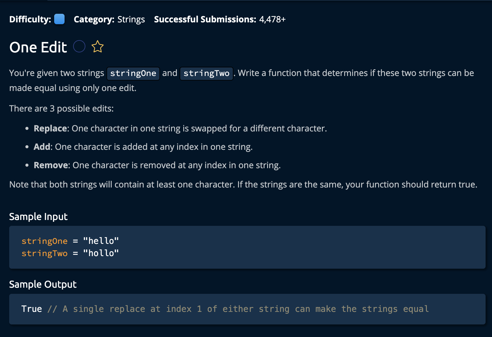

# One Edit

## Description



## Solution
```py
def oneEdit(stringOne, stringTwo):
    lengthOne, lengthTwo = len(stringOne), len(stringTwo)
    if abs(lengthOne - lengthTwo) > 1:
        return False

    madeEdit = False
    indexOne, indexTwo = 0, 0

    while indexOne < lengthOne and indexTwo < lengthTwo:
        if stringOne[indexOne] != stringTwo[indexTwo]:
            if madeEdit:
                return False
            madeEdit = True

            if lengthOne > lengthTwo:
                indexOne += 1
            elif lengthOne < lengthTwo:           
                indexTwo += 1
            else:
                indexOne += 1
                indexTwo += 1
        else:
            indexOne += 1
            indexTwo += 1

    return True
```

**Time Complexity:** O(n) where **n** is the length of the smaller string.<br/>
**Space Complexity:** O(1)<br/>

### Approach
The approach is to first, check and make sure the difference between the lengths of the two input strings are no more than 1. If so, we can immediately return **false** because we'd need two edits to make them equal<br>

Next, we iterate through both of the strings, and check if the characters are equal, if at any point they aren't, we chech if we have previously made an edit, if sow e return false because that means we'd need to make two edits. <br>

If this is the first time we made an edit, we check to see whuchh string is larger, and move the pointers accordingly before continuing the iteration.<br>

*Let's break down the steps.*

1. Ensure that the lengths of `stringOne` and `stringTwo` differ by no more than 1 character. If they do return false.
```py
def oneEdit(stringOne, stringTwo):
    lengthOne, lengthTwo = len(stringOne), len(stringTwo)
    if abs(lengthOne - lengthTwo) > 1:
        return False
```

2. Initialize `madeEdit` variable for keeping track f weather or not we've made an edit already while we are traversing hte two strings. Also create two pointers for the string iteration.

```py
    madeEdit = False
    indexOne, indexTwo = 0, 0 # Iteration starts at the first element
```

3. Until one of the pointers reach the end of their string: We compare the two characters from stringOne and stringTwo. We if they are not ewual, we need to make anedit, if we've made an edit already then we end the whileloop and return **False**.

```py
    while indexOne < lengthOne and indexTwo < lengthTwo:
        if stringOne[indexOne] != stringTwo[indexTwo]:
            if madeEdit:
                return False
```

4. Now, if this is the first time we are making an edit, the first thing we do is mark our amdeEdit variable to True. Then we check the string's length to see if we are looking at any one of the three following cases: <br>

- stringOne > stringTwo<br>
- stringOne < stringTwo<br>
- stringOne = stringOne<br>

Whichever string is larger, we icrem,ent that pointer since-if there is one edit- the rest of the strings should be the same. If the lengths are equal, that means all the characters are the same except for that current one, so we increment both ponters.
```py
            madeEdit = True

            if lengthOne > lengthTwo:
                indexOne += 1
            elif lengthOne < lengthTwo:           
                indexTwo += 1
            else:
                indexOne += 1
                indexTwo += 1
```

5. Now, back to the outer if statement. In the case where stringOne[indexOne] and stringTwo[indexTwo] are the same, we increment both counters in the main while loop.<br>
```py
        else:
            indexOne += 1
            indexTwo += 1
```

Note that the 3 cases listed earlier about `stringOne` and `stringTwo` take place in the nested if statement.

If we have reached the end of the while loop without making any edits, then we know both strings are equal, so can return True.

```py
return "".join(characters)
```
and we're **Done!**