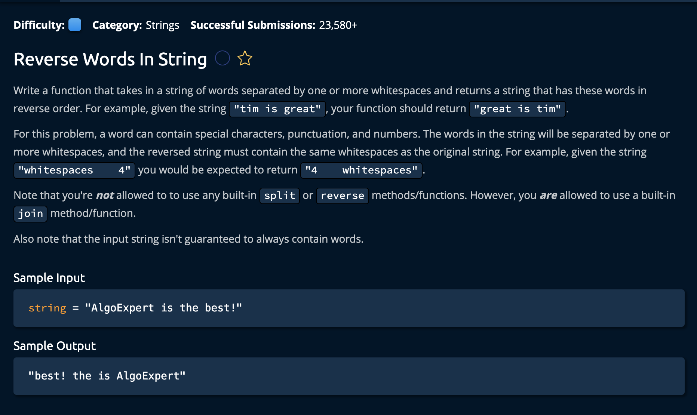

# Reverse Words In String

## Description



## Solution
```py
def reverseWordsInString(string):
    characters = [char for char in string]
    reverseListRange(characters, 0, len(characters) - 1)

    startOfWord = 0
    while startOfWord < len(characters):
        endOfWord = startOfWord
        while endOfWord < len(characters) and characters[endOfWord] != " ":
            endOfWord += 1

        reverseListRange(characters, startOfWord, endOfWord - 1)
        startOfWord = endOfWord + 1
    return "".join(characters)

def reverseListRange(list, start, end):
    while start < end:
        list[start], list[end] = list[end], list[start]
        start += 1
        end -= 1
```

**Time Complexity:** O(n) For iterating through every char in var `string`<br/>
**Space Complexity:** O(n) creating a string of equal size to `string`<br/>

### Approach
The Approach is create a list of characters that is equivalent ot the strings so tha twe can manipulate it. Then we reverse the entire string and itentify where we have found a word. Once we do, we "re-reverse" that string.<br>

*Let's break down the steps.*

1. Create a variable `characters` that will hold a list of characters equivalent to the input string. 
```py
def reverseWordsInString(string):
    characters = [char for char in string]
    reverseListRange(characters, 0, len(characters) - 1)
```

sincere we cannot use any biuilt in reverse functions, we will create our own called **reverseListRange()**. 

2. Initialize are `startOfWord` variable and initialte a whileloop that continues until the start of the word reaches the endpoint of `characters`.

```py
 startOfWord = 0
    while startOfWord < len(characters):
```

3. Now, we set the end of word at the same point as start of word, incrementing as long as we do not encournter a " " or the end of the array.
```py
        endOfWord = startOfWord
        while endOfWord < len(characters) and characters[endOfWord] != " ":
            endOfWord += 1
```

4. Once we encounter a space(or the end of the array) we reverse the range between `startOfWord` and `endOfWord`.
```py
        reverseListRange(characters, startOfWord, endOfWord - 1)
        startOfWord = endOfWord + 1
```
We also set startOfWord to the char after the endOfWord so we can continue our search, OR so that we can end the while loop.<br>

*Let's break down the reverse function!*

### reverseListRange(list, start, end):
- list of `characters`
- start of the word we want to reverse
- end of word we want to reverse

5. As long as the start is less than the end we swap its values, then we move the pointers one index closer to the middle.
```py
def reverseListRange(list, start, end):
    while start < end:
        list[start], list[end] = list[end], list[start]
        start += 1
        end -= 1
```
This also accoints for the cases where we have one or two middle indeces. If we have one than it just wont be alterd. if we have two they will be switched. <br>

Finally, after reversing hte last word, we join the list of characters to make a string and return it

```py
return "".join(characters)
```
and we're **Done!**