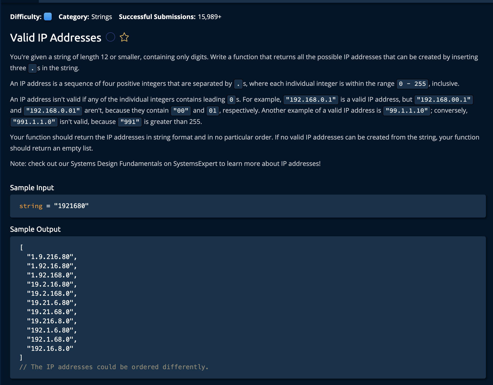

# Valid IP Addresses

## Description



## Solution
```py
def validIPAddresses(string):
    ipAddressesFound = []

    for i in range(1, min(len(string), 4)):
        currentIPAddressParts = ['', '', '', '']

        currentIPAddressParts[0] = string[:i]
        if not isValid(currentIPAddressParts[0]):
            continue

        for j in range(i + 1, i + min(len(string) - i, 4)):
            currentIPAddressParts[1] = string[i: j]
            if not isValid(currentIPAddressParts[1]):
                continue

            for k in range(j + 1, j + min(len(string) - j, 4)): 
                currentIPAddressParts[2] = string[j: k]
                currentIPAddressParts[3] = string[k:]
                if isValid(currentIPAddressParts[2]) and isValid(currentIPAddressParts[3]):
                    ipAddressesFound.append('.'.join(currentIPAddressParts))
                    
        
    return ipAddressesFound


def isValid(string):
    stringAsInt = int(string)
    if stringAsInt > 255:
        return False

    return len(string) == len(str(stringAsInt)) # check for leading 0
```

**Time Complexity:** O(1) There are only 2^6 possible ways to check if the string is valid<br/>
**Space Complexity:** O(1) There are only 2^6 possible valid IP Adresses to store in the return array<br/>

### Approach
The idea is to create a check for every combination of IP adresses, WITHIN the bounds of the format of what a valid IP address etails. This result in setting the first two valid points and checking every valid position for the third point. After this we check everu valid combo for the second 2 points. then we move the first point and check for any more valid combinations.<br>

Keeping in mind that each index must be between 1 and 3 indeces apart, we will consturct our for loops to poerate within those bounds. Also keep in mind the nature of the Python splicing method: <br>
#### string[start:end]<br>
**start:** Inclusive — the slicing starts at this index.<br>
**end:** Exclusive — the slicing stops just before this index (it does not include the character at this index).<br>


*Let's break down the steps.*

1. Create a variable that will hold a list of all the valid IP adresses based on the given numbers.
```py
def validIPAddresses(string):
    ipAddressesFound = []
```
### The first for loop
2. Create the first for loop. This loop will control the movement of the first decimal point. We will start it directly after the first index.

```py
for i in range(1, min(len(string), 4)):
        currentIPAddressParts = ['', '', '', '']
```
Note that the range starts at the second index and stops at either the last element, or 4 elements after. Whichever comes first. We also initialize our `currentIPAddressParts` which will hold a valid IP adress to add to our return array.

3. Now, we initialize the first IPAdress part as everything before index `i`. Which at first would be only the first index(i is the second index). We create a function that checks if that current string(everything before `i`) is valid. If its not valid we move the pointer to the next index and check again.
```py
        currentIPAddressParts[0] = string[:i]
        if not isValid(currentIPAddressParts[0]):
            continue
```
However, if the `currentIPAddressParts` is valid, we go to stage two.

### The second for loop
4. Next, we check the valididy of the second IP address section(currentIPAddressParts[1]). We do this with the same logic as the outer for loop except tjhe range is `i + 1` -> `i + min(len(string) - i, 4)` instead of `1` -> `min(len(string), 4)` lets break that down though. <br>

In the outer loop we had the constraint that the first `.` could be at most 3 indeces from the start. That, or at the very least in the bounds of the `string`, hence why we take the smaller of the length(**array**) and **4**(ie. the max the lenth it can be is 3). <br>


```py
 for j in range(i + 1, i + min(len(string) - i, 4)):
```
Then we set the second address section as that portion we have determined that falls within the range descrinbed above. We then check if its valid. If not we move the second point to the right.
```py
 currentIPAddressParts[1] = string[i: j]
            if not isValid(currentIPAddressParts[1]):
                continue
```

If the `currentIPAddressParts[1]` is valid, we move to the third and final stage.

### The third for loop
4. Now we are in the second nested for loop. This one is responsible for the movement of the third point. The bounds are the same except the left boudn is no lomnger i but j(which was used in the loop on layer above).
```py
for k in range(j + 1, j + min(len(string) - j, 4)): 
```

The only difference is that now we check both the third and fourth sections together, If they are both valid, then we can append all 4 sections together and add it to our answer.

```py
 for k in range(j + 1, j + min(len(string) - j, 4)): 
                currentIPAddressParts[2] = string[j: k]
                currentIPAddressParts[3] = string[k:]
                if isValid(currentIPAddressParts[2]) and isValid(currentIPAddressParts[3]):
                    ipAddressesFound.append('.'.join(currentIPAddressParts))
```
Also notice we used join to to take every item in `currentIPAddressParts` and join them using the `.` character.<br>

Now, let's quickly describe the isValid function.

## isValid(string):

5. Convert the string to an integer, and check if its less than 255 if not we return **False** because that is the max value.

```py
    stringAsInt = int(string)
    if stringAsInt > 255:
        return False
```

Then we check if the string has any leading zeros. Because we know the that the typecaset **int()** in python removes excessive zeros, we can comapre the length of the `string` and the `stringAsInt`.

```py
# hence we return this
 return len(string) == len(str(stringAsInt)) # check for leading 0
```

and we're **Done!**